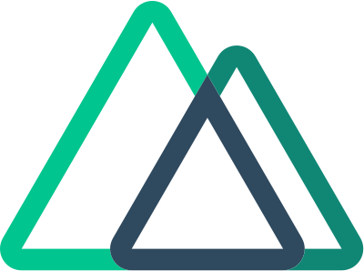

<!--
**outama-othmane/outama-othmane** is a ✨ _special_ ✨ repository because its `README.md` (this file) appears on your GitHub profile.

Here are some ideas to get you started:

- 🔭 I’m currently working on ...
- 🌱 I’m currently learning ...
- 👯 I’m looking to collaborate on ...
- 🤔 I’m looking for help with ...
- 💬 Ask me about ...
- 📫 How to reach me: ...
- 😄 Pronouns: ...
- ⚡ Fun fact: ...
-->

### Hi there 👋
- :blush: I am Othmane Outama, a computer science student at ENSA Marrakech.
- 🔭 I’m currently building web applications.
- 👯 I'm open for collaborations in projects using PHP, Laravel, Vue.js and Nuxt.js.

#### Languages and Tools :wrench:  
<code></code>
<code></code>
<code></code>
<code></code>
<code></code>
<code></code>

#### Get in touch :speech_balloon:
 

